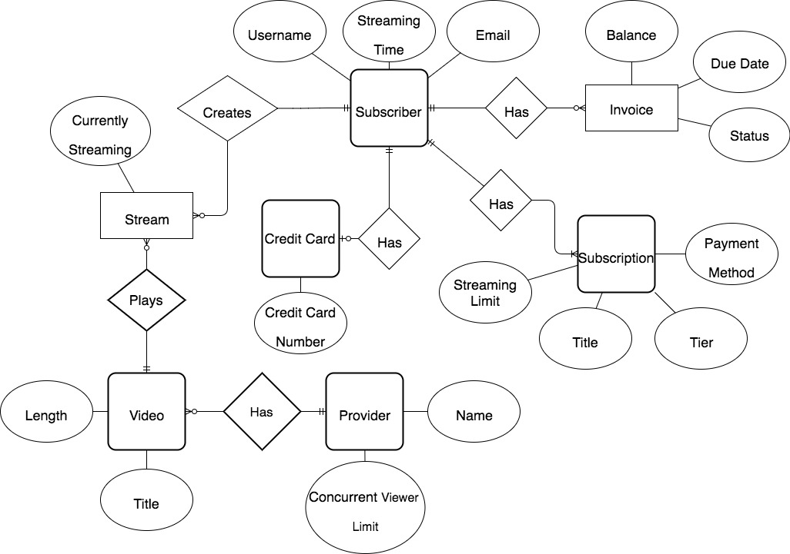

# vidsi
Lifion coding test

## Entity Relationship Diagram



## SQL Query

```sql
SELECT
  subscribers.username as User, videos.title as Video, count(streams) as Views
FROM
  streams
JOIN
  subscribers on subscriber_id = subscribers.id
JOIN
  videos on video_id = videos.id
GROUP BY
  videos.title, subscribers.username
ORDER BY count(streams) DESC LIMIT 20;
```

## Algorithm

## Process Flow
